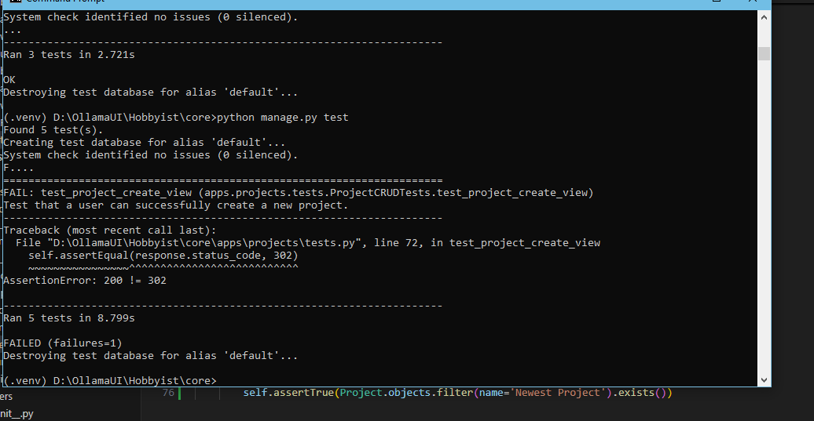
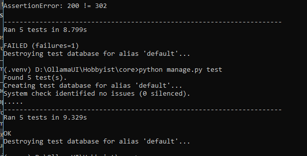

# The Hobbyist's Project & Inventory Tracker

This project was built for my "Full Stack Frameworks with Django" module (L5 Diploma in Web Application Development). It's a full-stack web application designed from the ground up to be a useful, original tool for hobbyists.

**Live Site:** [https://hobb-5e258a5700a4.herokuapp.com/](https://hobb-5e258a5700a4.herokuapp.com/) (Example URL)

---

## 💡 Project Overview

The Hobbyist's Project & Inventory Tracker is a web app for people who love making things—whether it's painting miniatures, building models, knitting, or tinkering with electronics.

I noticed that many hobbyists use simple spreadsheets or notebooks to keep track of their projects and supplies. I wanted to build a dedicated, easy-to-use platform that makes this process much smoother. The app allows users to create an account, document all their ongoing projects, log their progress, and maintain a detailed inventory of all their parts and supplies.

The goal was to create something that wasn't just another tutorial project, but a genuinely useful tool that solves a real-world problem for a specific community.

### User Personas

To make sure the app was practical, I designed it with two main types of users in mind:

* **Alex, the Enthusiast:** An experienced hobbyist with lots of projects and a big collection of supplies. Alex needs a powerful way to stay organised and show off their finished work.
* **Ben, the Beginner:** Someone new to a hobby, working on their first few projects. Ben needs a simple tool to track their progress and list the supplies they need to buy.

---

## ✨ Key Features

### Account Management
* Users can create a secure account with an email and password.
* Standard login and logout functionality.
* The site shows different content to guests and logged-in users.


### Project & Inventory Management (CRUD)
* Authenticated users can **Create**, **Read**, **Update**, and **Delete** their own projects and inventory items.
* A central dashboard lists all of a user's projects.
* Each project has a detail page showing its description, status (e.g., 'In Progress', 'Completed'), and any required supplies.
* A separate inventory page lists all supplies the user owns.


### Premium Account Upgrade (E-Commerce)
* Users can make a **one-time payment** using Stripe to upgrade to a "Premium" account.
* The payment flow is secure and uses Stripe Webhooks to reliably update the user's account status after a successful payment.
* Users see clear confirmation pages after their payment attempt.

### Premium Features
* As a proof-of-concept for the premium tier, upgraded users gain the ability to upload multiple photos to create a gallery for their completed projects.

---

## 🏗️ Design and Data Modeling

### UX Design & Wireframes

My goal was a clean, intuitive, and accessible user experience. I focused on a few key principles:
* **Consistency:** The navigation bar, colours, and button styles are the same across the entire site.
* **Clear Hierarchy:** I used semantic HTML and clear headings to make the layout logical and easy to understand.
* **User Feedback:** The app provides clear messages after important actions, like saving a form or deleting an item.
* **Accessibility:** I paid attention to colour contrast and ensured all images have descriptive alt text.

Before writing any code, I planned the main pages using low-fidelity wireframes in Balsamiq to focus on the layout and user flow.


### Data Model (Entity-Relationship Diagram)

The application is built on a relational database. I designed a schema with several custom models to handle all the data. The main models are:

* **Profile:** A one-to-one link with the built-in User model to store extra info, like whether the user is a premium member.
* **Project:** Stores all the details for a single hobby project.
* **InventoryItem:** Represents a single supply item a user owns.
* **ProjectInventory:** A 'through' model to link projects and inventory items, allowing a user to specify how many of each item a project needs.

This diagram shows how the models are related:


---

## 🛠️ Technologies Used

* **Backend:** Python, Django
* **Frontend:** HTML, CSS, JavaScript
* **Database:** PostgreSQL (Production), SQLite3 (Development)
* **Deployment:** Heroku, Gunicorn
* **Key Python Libraries:**
    * `django-environ` (for managing environment variables)
    * `Stripe` (for payment processing)
    * `psycopg2-binary` (PostgreSQL adapter)
    * `whitenoise` (for serving static files in production)

---

## 🚀 Running the Project Locally

To run this project on your own machine, follow these steps:

1.  **Clone the repository:**
    ```bash
    git clone [https://github.com/ragzad/Hobbyist.git](https://github.com/ragzad/Hobbyist.git)
    cd hobby-tracker
    ```

2.  **Create and activate a virtual environment:**
    ```bash
    python -m venv .venv
    # On Windows
    .venv\Scripts\activate
    # On macOS/Linux
    source .venv/bin/activate
    ```

3.  **Install the dependencies:**
    ```bash
    pip install -r requirements.txt
    ```

4.  **Set up your environment variables:**
    * Create a new file named `.env` in the root directory.
    * Copy the contents of `env.example` into your new `.env` file.
    * Fill in the required values (you'll need your own `SECRET_KEY` and Stripe API keys).

5.  **Run the database migrations:**
    ```bash
    python manage.py migrate
    ```

6.  **Start the development server:**
    ```bash
    python manage.py runserver
    ```
    The application will be available at `http://127.0.0.1:8000/`.

---

## 🧪 Testing

I used Django's built-in testing framework to write unit tests for the application. The tests cover:
* **Model methods:** Ensuring any custom logic on the models works correctly.
* **View responses:** Checking that pages return the correct status codes (e.g., 200 for success, 404 for not found, 302 for redirects).
* **Form validation:** Testing that forms correctly accept valid data and reject invalid data.
* **Authentication:** Making sure protected pages correctly redirect non-authenticated users.

| Function Implemented | Test Undertook | Screenshots |
| :--- | :--- | :--- |
| **User Login & Registration** | 1. **Sign Up:** Navigated to `/accounts/signup/`, created a new user, and verified successful redirection to the login page. <br> 2. **Login:** Logged in with the new user credentials and verified redirection to the project dashboard. <br> 3. **Logout:** Clicked the logout button and verified successful redirection back to the login page. <br> 4. **Access Control:** While logged out, attempted to access `/projects/` and was correctly redirected to the login page. |  |
| **Stripe Payment Checkout** | 1. Navigated to the `/upgrade/` page and clicked the "Pay with Stripe" button. <br> 2. Verified redirection to the official Stripe checkout page. <br> 3. Used Stripe's dummy card number (4242...) to simulate a successful payment. <br> 4. Verified redirection to the `/upgrade/success/` page after payment. <br> 5. Tested the cancel flow and verified redirection to the `/upgrade/cancel/` page. |  |
| **Premium Feature: Photo Upload** | 1. **Non-Premium User:** Verified that a standard user sees the "Upgrade to Premium" link and not the upload form. <br> 2. **Premium User:** Logged in as a premium user and navigated to a project detail page. <br> 3. **Form Visibility:** Verified that the photo upload form is visible. <br> 4. **File Upload:** Selected a valid image file and clicked "Upload Photo". <br> 5. **Verification:** Confirmed that the page reloaded and the new photo was displayed in the project gallery. |  |
| | | |

## 🧪 Automated Testing

To ensure the application is robust and to prevent future changes from breaking existing functionality, I have implemented a suite of automated tests using Django's built-in testing framework.

These tests are designed to run automatically and verify that the core components of the application behave as expected under different scenarios, including crucial security checks.

### Tests Implemented

The test suite for the `projects` app has been expanded to cover the full CRUD (Create, Read, Update, Delete) lifecycle and key security concerns:

* **Model Representation:** Confirms that the `Project` model's string representation (`__str__`) works correctly.
* **List View Logic:**
    * Verifies that a logged-in user can see their own projects on the dashboard.
    * Confirms that logged-out users are correctly redirected to the login page.
* **Detail View Security:** A key security test that ensures a user can access the detail page for their own project but receives a **404 Not Found** error if they try to access a project belonging to another user.
* **Create View Functionality:** Tests that a logged-in user can successfully submit the form to create a new project and that the new project is correctly saved to the database.

### The Testing Process

Initially, a test for the "Create View" failed because the test was not providing all the required data to the form. This is a perfect example of how testing helps catch bugs early.

The initial test run showed a failure, as it did not account for the `status` field being required.



After identifying the missing field in the test's payload, the test was amended.



### Running the Tests

To run the full test suite, execute the following command from the project's root directory:

```bash
python manage.py test